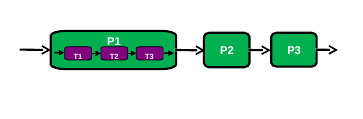
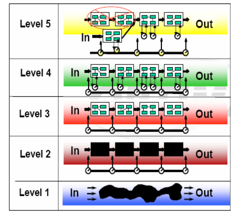
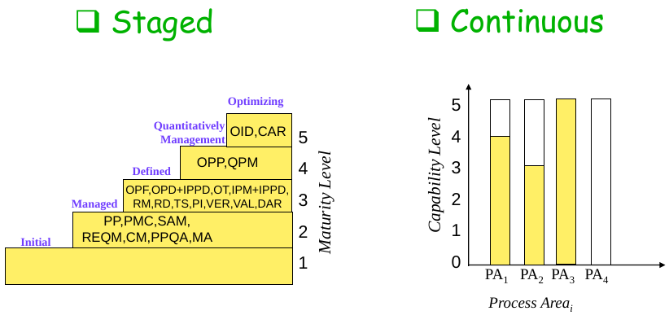

# 3/14

## What

* 定義：一組**有次序**的活動。受限制、需資源 以產出事物
  * 
* 特性
  * 描述其下 _process活動_ 或 _subprocess_
    * e.g. P1 描述 T1, T2, T3
  * 具有 intermediate 或 final product \( output \)
  * 具有次序
  * 具有資源限制
  * 具有目的

### Engineering Software 2 Phases

#### Generic Activity

* What
* How
* 系統完成後之變動 - Change
  * **Correction** 系統本身之錯誤
  * **Enhancement** 加入功能
  * **Adaptation** 環境轉換
  * **Prevention** 加強效率
    * re-engineering

#### Umbrella Activity

* 以求如期如旨完成Product

### 流程

#### Management and Development

* Management
* 1. Conception
  2. Definition
  3. Start
  4. Steady State
  5. Termination
* Development\( 從管理階段的 start 後開始 \)
* 1. Analysis
  2. Design
  3. Coding
  4. Testing
  5. Termination

**Software engineering vs System engineering**

* system engineering  包含硬體、軟體與process engineering
* software engineering 軟體

## Who

1. programmer
2. software engineering
3. system engineering

## How

### CMMI

capability maturity model integration

**About**

* 1984 美國國防部\(DoD\)及國防工業協會\(NDIA\) 委託 CMU 設計
* SEI \(軟體工程機構\)
  * 5 個階段的成熟度
    * key activities
  * framework 整合定義
* Process Areas \(PAs\)
  * Process Management
  * Project Management
  * Engineering
  * Support

**CMMI representations**

* Staged \(Maturity Levels\)
  * 1. Initial 
    2. Managed 
    3. Defined 
    4. Quantitively Management
    5. Optimizing
  * 
* Continous \(Capability Levels\)
  * 以各PA的程度表示
* 

temp:

product

