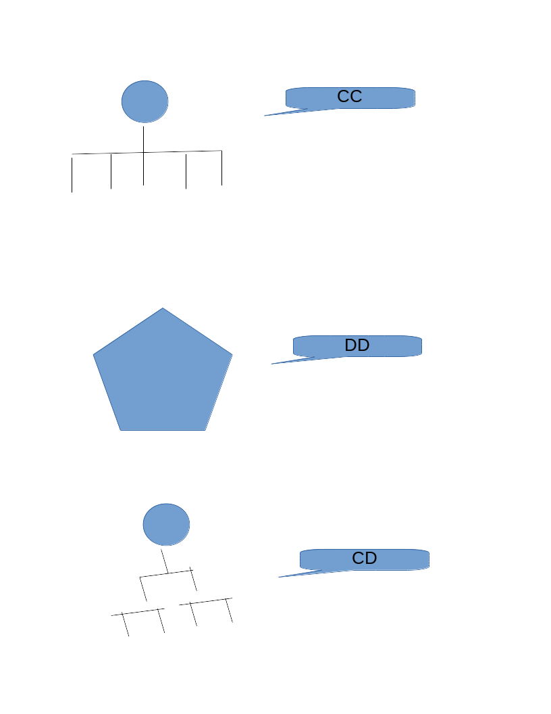
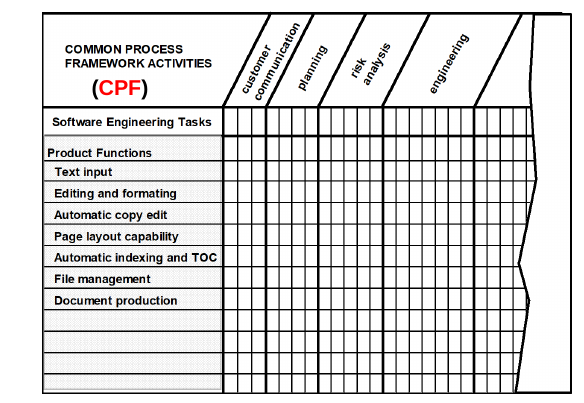

# 3/28

人、事、物、時間

## Management Spectrum

4'P

* People
* Product
* Process
* Project

### People

stakeholder - 與整個project產出的相關人員

1. team leader
2. 管理方式
   * CC
   * CD
   * DD
   * 
3. 問題
   * Considered Factors

     DD – the difficulty of the problem

     CC – the size of the resultant program\(s\) - \(big size\)

     DD – team lifetime - 感情因素\(long time\)

     CC – the degree of problem modularizing

     CC – the required quality and reliability

     CC – the rigidity of the delivery date

     DD – the degree of sociability

## Product

* 軟體
  * context - project 背景
  * 目標 objective
  * 功能與效能
* 問題剖析

-

Common Process Framework

* 問題：在project進行過程中，什麼跡象可以看出project是否成功或失敗？
* 
