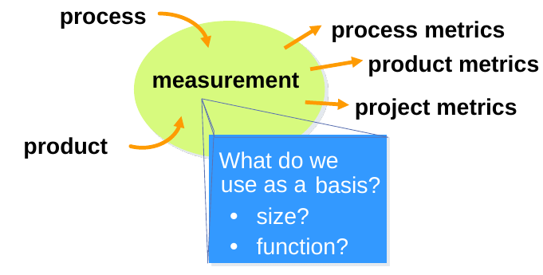
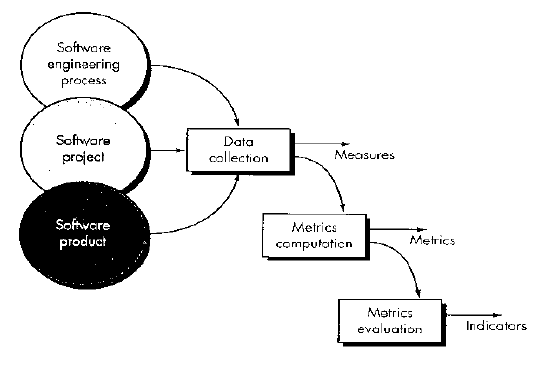
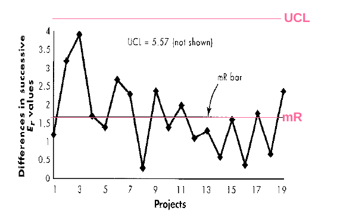
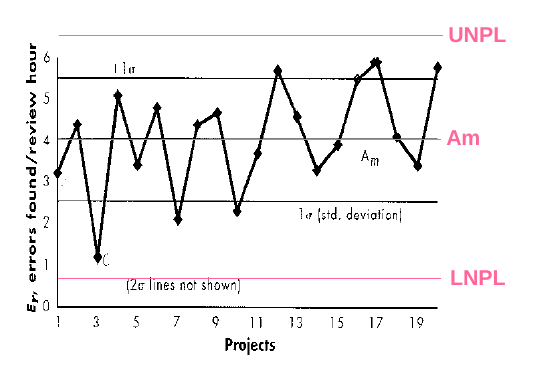

# Measure\_for\_Software\_Engineering

## Measure for Software Engineering

* 透過量測，可以...
  * 了解系統性質
  * 了解系統效率
  * 進行系統預測
  * 進行系統改進

-

### 量測的過程

* Formulation
* Collection
* Analysis
* Interpretation
* Feedback

### 量測的原則

1. 資料收集的目標要在資料收集明確建立
2. 保持資料收集的簡單性
3. 確認資料是有意義的
4. 資料能被做出解釋
5. 收集需要花費金錢與時間
   1. 初期：3%~8% \(佔總成本\)
   2. 後期：1%

### 量測的分類

* 直接量測：direct measures
  * e.g. cost, effort, memory size, execute speed...
* 間接量測：indirect measures
  * e.g. quality, complexity, efficiency ...

### Measure

一個量化的指標，協助我們將現實世界表現於數學模型。Modeling

### Metric

量化的數據，用以形容現實世界

### Indicator

* Process indicator
* project indicator
* product indicator

## Metrics baseline 收集資料

* 關於資料庫需要..
* 合理性的準確
* 越多越加
* 一致性
* 相似性

-

e.g.

mR: mean of moving range = 1.71

UCL: Upper control limit = mR x 3.268 = 5.58

-

e.g.

Am: Average value

UNPL: Upper Natural Process Limit

* = mR\*2.66+Am = 8.25

LNPL: Lower Natural Process Limit

* = mR\*2.66 - Am = 0.55
*  : standard derivation = \(UNPL-Am\)/3 = 152

