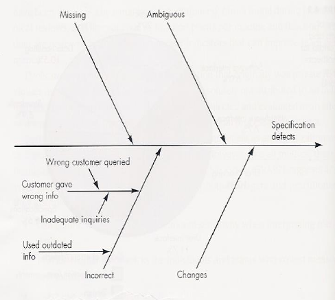

# 4/11

chapter 4

## Metrics for Analysis Model

1. Typical Size-Oriented Metrics
2. Function-Oriented Metrics

-

* Size-Oriented Metrics
  * Metrics \( \[item\] per KLOC\)
    * errors
    * defects 
    * $
    * page\# of doc. 
  * 優點：易於測量
  * 缺點：
    * 程式語言不同 - LOC不同
    * 程式 not well design \(長度越長越好造成）
    * 程式完成後才能衡量
* Function-Oriented Metrics
  * Function Point \(FP\)
  * complexity adjustment values \(Fi ; i=1-14\)
  * 1. analysis information domain of the applications and develops count
    2. weight each count for assessing complexity
    3. assess influence of global factors that effect application
    4. count functional point \(FP\)
  * 優點
    * 沒有程式語言不同的問題
    * 程式尚未開始前即可評估
  * 缺點
    * 結果比Size-Oriented不直覺
    * 評估過於主觀

-

* Reconciling兩種Metrics方式 
  * LOC ≒ FP \* \[language parameter\]

-

### Process Metrics

#### Defect Remove Efficiency \(DRE\)

* For Project 
  * DRE = \(errors\) / \(errors+defects\)
* For Process
  *  = / \(+\)

-

#### SSPI

statistical software process improvement

* Fish bone diagram
  * 

### Product Metrics

1. Product Operation 
   1. Correctness
   2. Reliability
   3. Usability
   4. Integrity
   5. Efficiency
2. Product Revision 
   1. Maintainability
   2. Flexiability
   3. Testability
3. Product Transition
   1. Portability
   2. Reuseability
   3. Interoperability

#### 評估之常見作法

* Correctness
  * Operate correctly
  * defects per KLOC
* Maintainability
  * 變動容易
  * mean-time-to-change\(MTTC\)
* Integrity
  * 外部漏洞（遭到攻擊）之機率
  * integrity = sum\( 1 - threat\( 1 - security \) \)
* usability
  * 易於使用與否
  * learning time, productivity, assessment of user
* reliability
  * MTBF = MTTF + MTTR
  * MTBF = MTTF + MTTR
    * MTBF: Mean Time between failure
    * MTTF: Mean Time To Failure
    * MTTR: Mean Time To Repair

-

### Project Metrics

