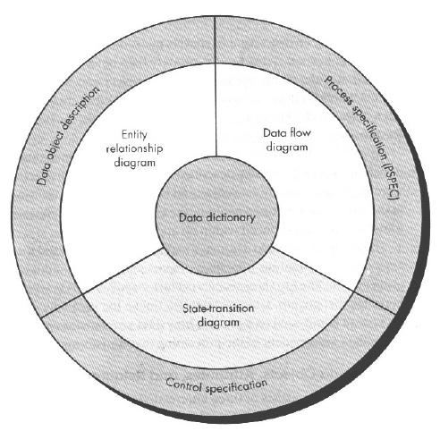

# 4/25

什麼是Risk

* 無預期的情況使得損失
* 若提前預知，可以減少損失

為什麼要做風險管理

* 減少專案進行時的震盪
* 更佳的專案管理與追蹤

#### Risk

* 特性
  * Uncertainty
  * Loss
* 類別

  * Project Risks
  * Technical Risks
  * Business Risks

  -

  * Known Risks
  * Predictable Risks
  * Unpredictable Risks

  -

  * Generic Risks
  * Product-specific Risks

#### Strategies

* Reactive Risks Management
  * 被動
  * 發生再做處理
* Proactive Risks Management
  * 主動
  * 從根源處理問題

#### 流程

1. Risks Identification
   1. 人員問題及經驗
   2. 產品大小
   3. 市場影響 etc.
2. Risks Analysis
   1. 發生的機率與影響
   2. 建立Risk Table

