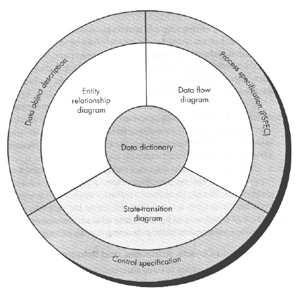

# Chapter 12

## Analysis Modeling

* structure method
* ...

### structure analysis model

#### Data Modeling

* Data object
* Process specification \(PSPEC\)
* Control specification
* Data dictionary

## Testing Modeling

> 在送出給客戶前，用最少的時間與工作量去找出錯誤

### 原則

* 規劃
  * 在testing前就已規劃好testing plan
* 由小而大
* 測試不可能無止無盡
  * pareto principle
    * 80/20
* 可追蹤至顧客需求

1.  效率
2. 由獨立的第三者判定

